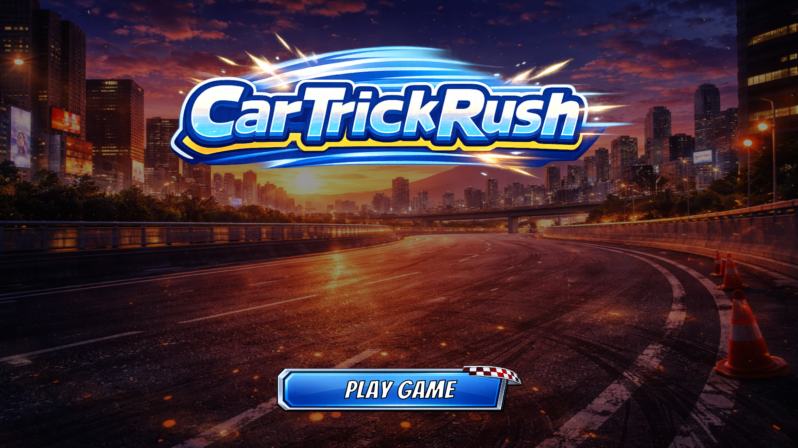
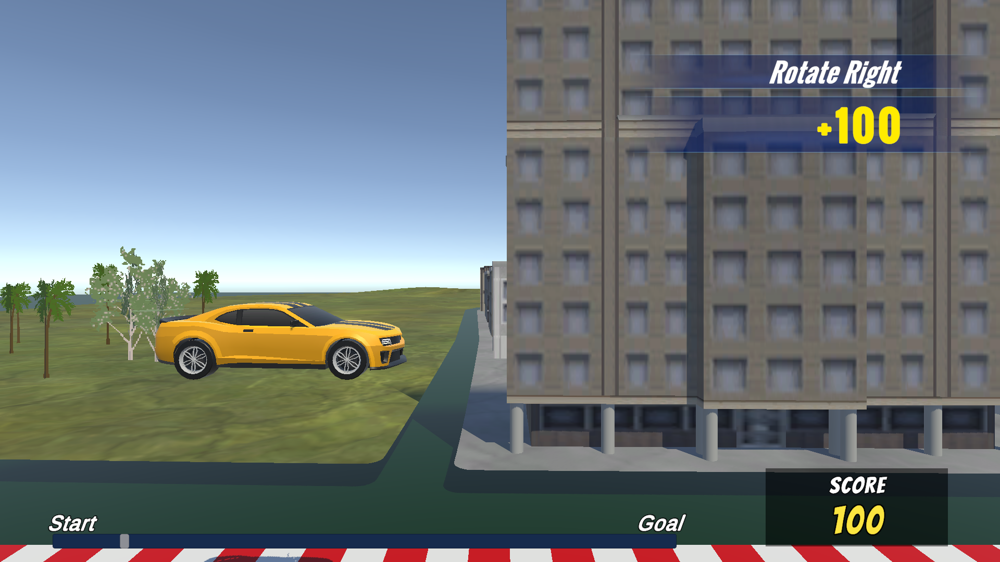

# Car Trick Rush

車の空中回転（トリック）でスコアを稼ぐ **オートスクロール型アクション**。  
**Unity 6** で設計・実装・演出・UI まで一貫して制作した **個人ポートフォリオ作品** です。

**WebGL 版（プレイ）:** [Car Trick Rush — Unity Room](https://unityroom.com/games/car-trick-rush)

---

## このプロジェクトで伝えたいこと

本プロジェクトでは以下を重視しています。

- **責務分離された設計** — 拡張と保守を見据えたレイヤーと依存の扱い  
- **ユーザー体験を踏まえた実装判断** — 仕様だけでなく「遊んでわかる」品質への投資  
- **短期間での優先順位付け** — スコープ管理と、「なくても成立するが、あると体験が向上する」要素の選別  

制作の背景として、転職・スキル整理の文脈で **設計力・実装力・開発効率** を可視化するアウトプットでもあります。フォルダ構成・命名・コメント・Notion による簡易仕様・タスク管理など、プロセス面も意識して進めています。

---

## 技術的な特徴

### 設計

- **Manager / Presenter / View** を意識した責務分離  
- **ManagerLocator** による依存の集約  
- **状態管理（State パターン）** によるプレイヤー制御  
- **シーン分割 + 追加読み込み** による UI 管理（ポーズ・設定など）

### UI / UX

- **スコア表示 UI を独自設計** — 最新スコアを強調、過去スコアは縮小表示、**最大 3 件** に絞って視認性を確保  
- **ポーズ / 設定** を追加シーンで実装し、ゲーム進行を妨げない **HUD 配置**

### 演出

- トリック成功時と通常時で **エフェクト・サウンド** を切り替え  
- ペナルティ時は **爆発エフェクト・点滅** でフィードバックを明確化  
- **ルール画像を用いたフェード** — 汎用的なトランジションとして再利用可能

### 実装スタック

- **Input System**（新 Input System）  
- **ScriptableObject** によるデータ・挙動の拡張余地  
- **URP** / **TextMeshPro**

---

## 工夫した点（ユーザー視点）

- **情報量の制御** — スコアは最大 3 件、アニメーションで視線誘導と体験を補強  
- **当初スコープ外だった要素の追加** — ポーズ（リトライ性）、設定（音量）、ペナルティ演出（視認性）  
- **短期開発での判断** — 必須機能を優先しつつ、体験への効果が大きい追加にリソースを振り向けた  

---

## 課題と改善の方向性

| 領域 | 現状・課題 | 改善の方向 |
|------|------------|------------|
| **ビジュアル** | 車のアニメは簡易実装、ジャンプ台も見た目が簡素 | 物理ベース or リグ対応、ジャンプ台の専用グラフィックで視認性とゲーム性を一致させる |
| **コンテンツ** | ステージ・ギミック量に余地 | ステージ拡張、ジャンプ頻度・高低差・トリック誘発ポイントの **レベルデザイン見直し** |
| **ゲーム性** | バランス調整の余地 | データ駆動化の検討、コンボ調整、左右/上下回転の差別化、空中制御（滞空・ボーナス時挙動）で **「戦略的に回転を選ぶ」** 体験へ |

---

## Demo

|  |  |
| :---: | :---: |

---

## 起動方法

### Web（推奨）

1. [Car Trick Rush（Unity Room）](https://unityroom.com/games/car-trick-rush) を開き、ページの手順でプレイしてください。  
2. WebGL が動作するデスクトップブラウザ（Chrome / Edge / Firefox など）を推奨します。  

### Unity エディタ

1. リポジトリを Clone または ZIP で取得してください。  
2. **Unity 6（6000.3 系）** をインストールし、本フォルダをプロジェクトとして開いてください。  
3. **`BootScene`**（開発用は **`BootSceneDebug`**）から再生し、タイトル経由でゲームを開始できます。  

---

## 動作環境

- **Web**: WebGL 対応のデスクトップブラウザ  
- **エディタ**: Windows 10 / 11 推奨、Unity 6（6000.3 系）  

---

## 操作方法

### キーボード

| 操作 | 割り当て |
|------|-----------|
| 車体を左に傾ける / 左回転 | **A** または **←** |
| 車体を右に傾ける / 右回転 | **D** または **→** |
| 車体を前に傾ける | **W** または **↑** |
| 車体を後ろに傾ける | **S** または **↓** |
| ポーズ | **Esc** または **Backspace**（ポーズ中にもう一度で再開する場合があります） |

### ゲームパッド

| 操作 | 割り当て |
|------|-----------|
| 車体を左に傾ける / 左回転 | 左スティック左 ／ 十字キー左 |
| 車体を右に傾ける / 右回転 | 右スティック右 ／ 十字キー右 |
| 車体を前に傾ける | 左スティック上 ／ 十字キー上 |
| 車体を後ろに傾ける | 左スティック下 ／ 十字キー下 |
| ポーズ | **Start** |

---

## ライセンス・使用素材

- **BGM / SE**: [魔王魂](https://maou.audio/), [OtoLogic](https://otologic.jp), [効果音ラボ](https://soundeffect-lab.info), [Springin' Sound Stock](https://www.springin.org/sound-stock/)  

（サードパーティアセットのライセンスは各フォルダの表記に従ってください。）
